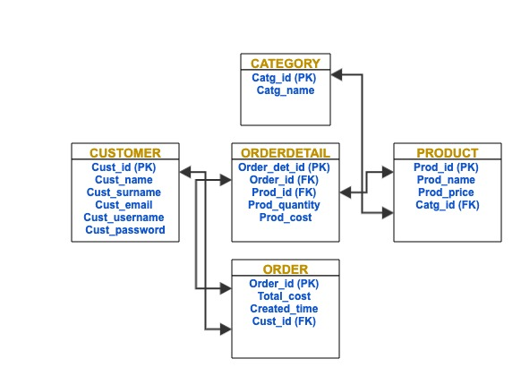

</p>
<!--  -->

# PROJECT NAME: Drinks Online Store
## by Jacob Gorelashvili
This project is a web-based online Drinks online store application. It is going to manage purchasing of available products on website, by adding to shopping cart and also adding to favourites of the wished products by a registered /unregistered user, and then make a checkout.

## Technologies used:
-Python\
-Django\
-React\
-Html\
-SQLite3

## Basic installation:
Back:
1) Install the requirements.txt file running the following code:\
    pip install -r requirements.txt 
2) Settings file in django project folder should be configured properly, copy its contents from here:\
 https://docs.google.com/document/d/1b48OSv1bGmo_WoG_KPQORGGfU5Iun-vo8-lPtRNwMsQ/edit#heading=h.txaehsr4h6ic

## DATABASE
My database structure in simple words:\
Obviously this project requires databases, managed by tables. Tables must interact with each other by using one's Foreign Keys.\
Foreign keys are column names for every table. Their names should appear exactly the same way as they appear in their parent table.\
If we need to extract information from one table, it is easy to do so by using SQL query with "SELECT" command.
However, if we need to extract the information from 2 or more tables and present them somewhere, foreign keys help us a lot. 
In Django, tables are created in a folder named "models" and their respective files named "models.py".\

--The Structure of creating a table in Django:--\
``` python
    class Product(models.Model):
            user =models.ForeignKey(User,on_delete=models.SET_NULL,null=True)
            desc = models.CharField(max_length=50,null=True,blank=True)
            price = models.DecimalField(max_digits=5,decimal_places=2)
            createdTime=models.DateTimeField(auto_now_add=True)
            _id=models.AutoField(primary_key=True,editable=False)
          fields =['_id','desc','price']
            def __str__(self):
     	        return self.desc 
```
As we see in the above table creation sample, every table has its primary key "PK", and it could also have Foreign key "FK", as in the sample above. \
Above, "user" is the FK, which means that "user" column from the "User" table and "user" column from "Product" table are interconnected, joined.\
So from now on, we can extract information from both tables, as they are already joined and communicating.
### This way, we are going to create as many tables as we need, so that all tables are joined and we can extract any needed info as per our request.

